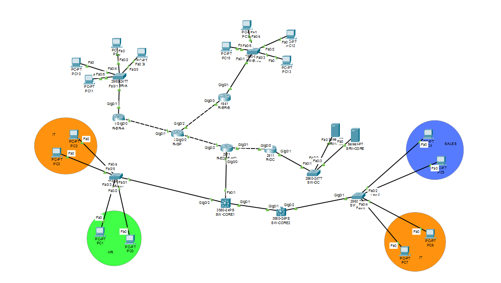

# Tamer Topology — Enterprise Network Design (Packet Tracer)

A multi-site enterprise network built in Cisco Packet Tracer, designed around a
redundant headquarters core, a dedicated data center, and remote branch sites —
built from scratch, one layer at a time, with every stage verified before moving
to the next.

## Origin

This project started from the fundamentals taught in **[KAAAM Academy's]([KAAM_LINK](https://www.linkedin.com/company/kaaam))**
CCNA training track (static/dynamic routing, VLANs, ACLs, HSRP, DHCP). I tried
to build into a larger, self-directed network to practice enterprise-scale
design, staged verification, and real command-line troubleshooting as tought at academy.

## Topology

- **HQ Core:** Dual Layer-3 switches (SW-CORE1/SW-CORE2) running inter-VLAN routing,
  HSRP gateway redundancy across 6 VLANs, and STP root/secondary hardening
- **HQ Access:** Access-layer switching with port security and 802.1Q trunking
  (dedicated native VLAN, hardened against VLAN hopping)
- **HQ Edge:** Dedicated edge router connecting HQ core to the Data Center and the
  wider WAN
- **Data Center:** Separate site hosting backend servers, connected via a routed
  link and integrated into the OSPF backbone
- **Branch Sites:** Two remote branch offices, each with their own router, switch,
  and endpoints, physically deployed and addressed, ready for WAN integration
- **Routing:** OSPF backbone (Area 0) across HQ Core, HQ Edge, and the Data Center,
  fully converged and verified at every stage via `show ip ospf neighbor` and
  `show ip route ospf`

## Technologies Used

| Category   | Technologies                                                                                        |
| ---------- | --------------------------------------------------------------------------------------------------- |
| Routing    | OSPF (multi-area design), router-ID assignment, backbone convergence                                |
| Redundancy | HSRP (core gateway failover, priority/preempt tuning)                                               |
| Switching  | VLANs, 802.1Q trunking, hardened native VLAN, Rapid-PVST, STP root/secondary                        |
| Security   | Port security (sticky MAC, violation restrict), SSH-only management, local AAA, encrypted passwords |
| Addressing | Structured VLSM addressing plan across VLANs, WAN links, and site subnets                           |

## Build Process

Every stage of this build was configured and verified individually before moving
to the next — base device hardening first, then VLANs and HSRP, then inter-site
routing — rather than configuring everything at once and debugging blind. Verification
at each stage included `show standby brief`, `show ip ospf neighbor`, `show ip route
ospf`, and `show interfaces trunk`, confirming real convergence rather than just a
config that "looks right."

## Files

- `/packet-tracer/` — the working `.pkt` file.
- `/docs/` — addressing table and OSPF design notes
- `/diagrams/` — topology diagram

## A Note on the .pkt File

All passwords and secrets = (`TamerCompany!`). 

---
Built by [Mohammed Tamer](https://www.linkedin.com/in/mohammed-tamer-11160a41a/) · Foundations from [KAAAM Academy](https://www.linkedin.com/company/kaaam)
